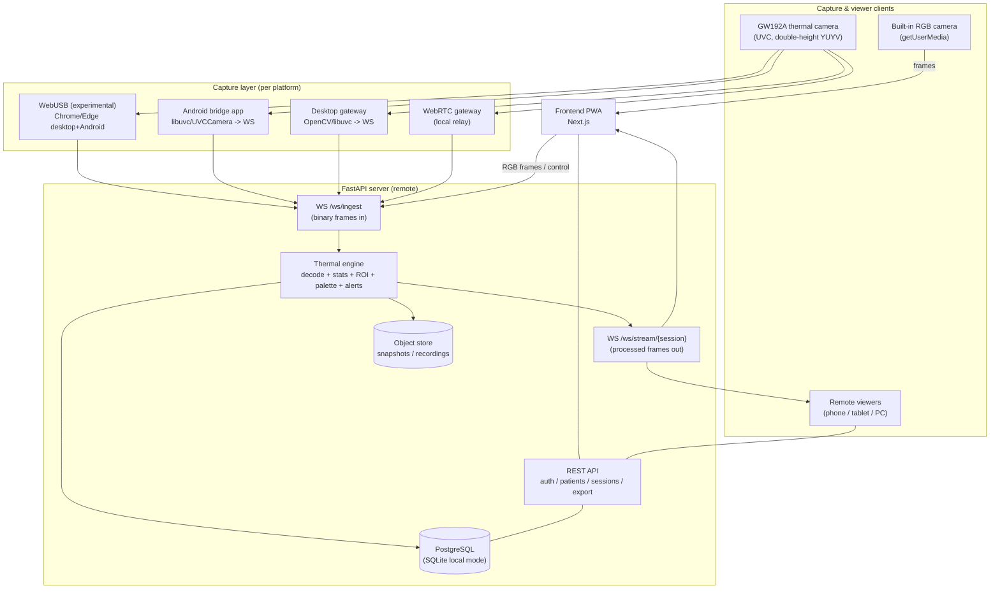
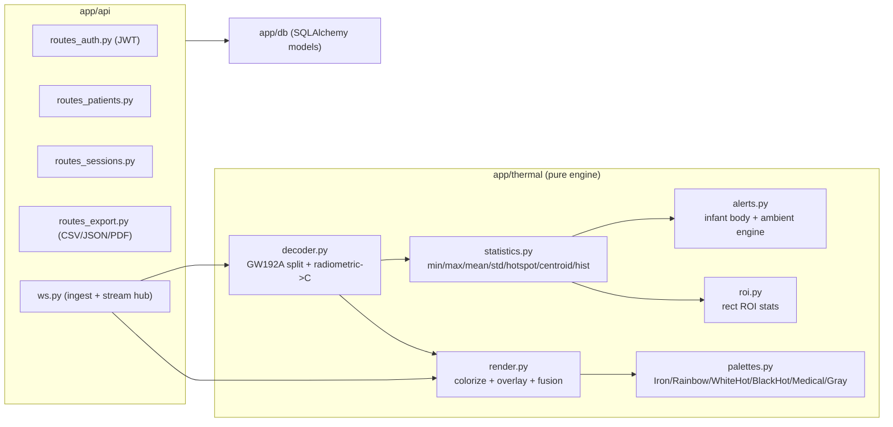

# 02 — Architecture & Component Design

## 1. High-level system



**Principle:** *capture is platform-specific, processing is centralized.* Every capture path
converts the GW192A into a normalized **radiometric frame message** and pushes it to
`/ws/ingest`. The server's thermal engine is the single source of truth for temperatures,
palettes, ROI math and alerts, so a $0 thin viewer gets the same results as a full client.

## 2. Frame ingest message contract

Clients send either **binary** (preferred, low-overhead) or **JSON** frames to `/ws/ingest`.

Binary layout (little-endian header + payload):
```
magic   : 4 bytes  = "GW19"
version : uint8     = 1
kind     : uint8    = 1 radiometric_u16 | 2 celsius_f32 | 3 rgb_jpeg
width   : uint16
height  : uint16
seq     : uint32    (frame counter)
ts_ms   : uint64    (capture epoch ms)
payload : width*height*bytes_per_px  (kind 1: u16 LE) OR JPEG bytes (kind 3)
```
JSON alternative (for WebUSB/debug): `{ "kind", "w", "h", "seq", "ts", "data": base64 }`.

The server replies on `/ws/stream/{session}` with processed JSON + an optional colorized PNG:
```json
{
  "seq": 1234, "ts": 0, "geometry": "192x192",
  "stats": { "t_min", "t_max", "t_mean", "t_std",
             "hotspot": [x,y], "coldspot": [x,y], "centroid": [x,y], "histogram": [...] },
  "rois": [ { "id", "name", "t_min", "t_max", "t_mean", "t_std" } ],
  "alerts": [ { "level", "code", "message", "value" } ],
  "palette": "iron",
  "image_png_b64": "..."
}
```

## 3. Backend module map



## 4. Fusion / display modes

| Mode | Source | Server output |
|---|---|---|
| **RGB** | built-in camera only | passthrough preview, no thermal |
| **Thermal** | GW192A radiometric | colorized palette PNG + stats |
| **Fusion** | RGB + thermal | thermal overlay alpha-blended on RGB, with controls: **transparency, alignment (dx,dy), scale, rotation** |

Fusion alignment is applied client-side on a canvas for zero-latency interactivity, while the
server provides the authoritative colorized thermal layer + measurements.

## 5. Folder structure

```
gw192a-thermal/
├── README.md
├── docs/
│   ├── 01-gw192a-research.md
│   ├── 02-architecture.md
│   ├── 03-platform-strategies.md
│   ├── 04-deployment.md
│   ├── 05-testing.md
│   └── 06-risks.md
├── validate/
│   └── validate_core.py            # stdlib-only proof of the engine
├── backend/
│   ├── requirements.txt
│   ├── pyproject.toml
│   ├── Dockerfile
│   ├── app/
│   │   ├── main.py                 # FastAPI app factory + routers + WS
│   │   ├── config.py               # pydantic settings (env)
│   │   ├── schemas.py              # pydantic DTOs
│   │   ├── core/
│   │   │   └── security.py         # JWT, password hashing, roles
│   │   ├── thermal/
│   │   │   ├── decoder.py          # GW192A frame decode (NumPy)
│   │   │   ├── palettes.py         # 6 thermal palettes (LUTs)
│   │   │   ├── statistics.py       # frame statistics
│   │   │   ├── roi.py              # ROI analysis
│   │   │   ├── render.py           # colorize / overlay / fusion (OpenCV)
│   │   │   └── alerts.py           # infant alert engine
│   │   ├── api/
│   │   │   ├── routes_auth.py
│   │   │   ├── routes_patients.py
│   │   │   ├── routes_sessions.py
│   │   │   ├── routes_export.py
│   │   │   └── ws.py               # /ws/ingest + /ws/stream/{session}
│   │   └── db/
│   │       ├── database.py         # engine/session (PostgreSQL | SQLite)
│   │       └── models.py           # User, Patient, Session, Reading, AlertEvent, Snapshot
│   └── tests/
│       └── test_thermal.py
├── gateway/
│   ├── gw192a_gateway.py           # desktop UVC capture -> WS (Method 4)
│   ├── requirements.txt
│   └── README.md
└── frontend/
    ├── package.json
    ├── next.config.js
    ├── tailwind.config.ts
    ├── postcss.config.js
    ├── tsconfig.json
    ├── public/
    │   ├── manifest.webmanifest
    │   └── sw.js                   # service worker (PWA offline shell)
    └── src/
        ├── app/
        │   ├── layout.tsx
        │   ├── globals.css
        │   ├── page.tsx            # Live Monitor (default)
        │   ├── history/page.tsx
        │   ├── alerts/page.tsx
        │   └── settings/page.tsx
        ├── components/
        │   ├── LiveMonitor.tsx
        │   ├── ThermalCanvas.tsx
        │   ├── FusionControls.tsx
        │   ├── StatsPanel.tsx
        │   ├── PaletteSelector.tsx
        │   ├── AlertBanner.tsx
        │   └── ModeSwitch.tsx
        └── lib/
            ├── api.ts              # REST client
            ├── ws.ts              # stream client + binary framing
            ├── camera.ts           # getUserMedia (front/back)
            ├── webusb.ts           # experimental WebUSB GW192A
            ├── thermal.ts          # shared types + thresholds
            └── alerts.ts           # client-side notify/vibrate/sound
```

## 6. Technology choices

| Layer | Choice | Rationale |
|---|---|---|
| Frontend | Next.js 14 (App Router), React 18, TypeScript, TailwindCSS | SSR + PWA, typed, fast UI iteration |
| Realtime | WebSocket (binary) | low-latency frame transport in both directions |
| Backend | FastAPI + Uvicorn | async, WS-native, OpenAPI out of the box |
| CV/math | OpenCV + NumPy | vectorized decode/colorize/overlay |
| DB | PostgreSQL (prod) / SQLite (local mode) | SQLAlchemy 2.0 abstracts both |
| Auth | JWT (access+refresh), bcrypt, RBAC | stateless, role-based (`admin`, `caregiver`, `viewer`) |
| Capture | Native Android bridge / desktop gateway / WebRTC / WebUSB | layered to match real platform limits |
```
