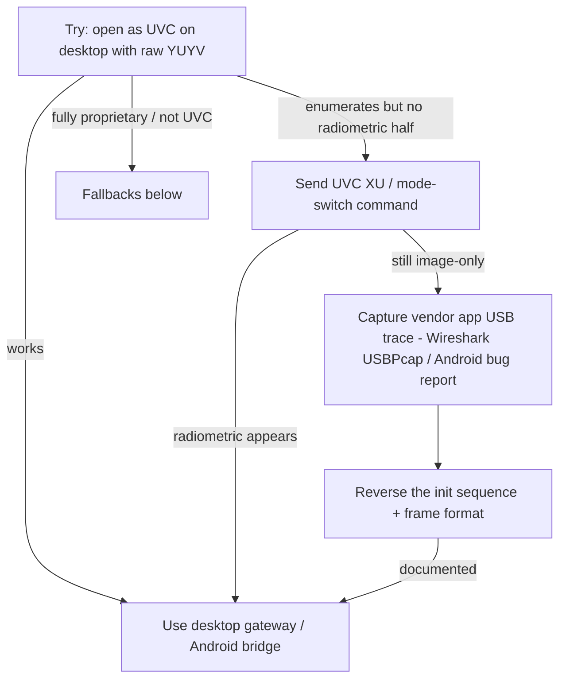

# 06 — GW192A Technical Risks & Alternatives

## Risk register

| # | Risk | Likelihood | Impact | Mitigation |
|---|------|-----------|--------|------------|
| R1 | **No universal browser USB access** (WebUSB unsupported on iOS/Firefox; OS claims UVC) | High | High | Layered capture: desktop gateway + Android bridge; WebUSB only experimental; iOS as viewer |
| R2 | **Radiometric half lost** because the OS color-converts YUYV | High | High | Force raw YUYV + `CAP_PROP_CONVERT_RGB=0`; verify doubled height on open; reinterpret bytes as `uint16` |
| R3 | **Firmware variance** in divisor/offset (`/64` vs `/16`, ambient/emissivity correction) or which half is radiometric | Medium | High | Calibration params (`KELVIN_SCALE`, `KELVIN_OFFSET`, `CALIB_GAIN/OFFSET`); gateway `--send-raw`; half-swap option; trim vs reference thermometer |
| R4 | **Device may require an init/XU command** to emit temperature mode | Medium | Medium | Gateway probes both modes; document UVC Extension Unit control; capture vendor app USB trace if needed |
| R5 | **iOS cannot read thermal in-browser** | Certain | Medium | Remote-viewer architecture; optional native Swift companion on USB-C devices |
| R6 | **Android OEM USB-OTG quirks** (permissions, power, detach) | Medium | Medium | Robust permission flow, reconnect/backoff, foreground service, tested OEM list |
| R7 | **Measurement accuracy ≠ clinical** (skin vs core temp, distance, emissivity, drift) | High | High (safety) | Prominent disclaimer; ROI guidance (forehead/inner canthus); calibration; not a medical device |
| R8 | **Low resolution (192×192) + small thermal span** for fever detection | Medium | Medium | ROI averaging, smoothing, medical palette tuned to the febrile band, fixed display scale |
| R9 | **WebSocket scaling** beyond one replica | Medium | Medium | Redis pub/sub fan-out; sticky sessions; ingest FPS cap |
| R10 | **Privacy/regulatory** (infant health data) | Medium | High | TLS, JWT+RBAC, encryption at rest, retention/deletion policy, audit logs |
| R11 | **USB power draw** on phones (camera + screen) | Low | Medium | Powered OTG hub option; reduce FPS; thermal-throttle awareness |

## Decision tree — if the GW192A does NOT expose standard USB access

### Fallback alternatives (in priority order)

1. **Reverse-engineer the init/stream sequence.** Capture the THG Start app's USB traffic
   (Android: `bugreport`/`USBPcap` via a Windows host; Linux: `usbmon` + Wireshark) to learn any
   control transfers and the exact frame layout, then implement it in the gateway. The sibling
   TC001/P2 are already documented, which de-risks this substantially.

2. **`libuvc`/`UVCCamera` instead of OpenCV.** If OpenCV's backend won't deliver the raw format,
   `libuvc` (desktop) and `saki4510t/UVCCamera` (Android) give frame-level control to request the
   exact format descriptor and read isochronous packets directly.

3. **Image-only / non-radiometric degraded mode.** If only the colorized half is reachable,
   estimate **relative** temperature from the palette using a known reference in-frame
   (e.g. a sticker at a known temperature) — clearly flagged as **uncalibrated/relative**.

4. **WebRTC gateway (Method 2).** A local service captures via any working native API and relays
   frames over WebRTC to the PWA — useful when WebSocket egress is constrained or for LAN-only,
   low-latency multi-viewer setups.

5. **Swap to a better-documented sibling.** If a specific GW192A unit proves intractable, the
   **Topdon TC001 / Thermal Master P2/P3 / InfiRay** share the data format and have open drivers;
   the entire server/engine/frontend here works unchanged — only the gateway's geometry/divisor
   constants change.

6. **Pure RGB fallback.** As a last resort the platform still functions as an RGB monitor (no
   temperature), preserving the dashboard, sessions, history, and remote viewing.

## Safety stance

Surface thermography is a **screening aid**, not a diagnosis. This platform must always:
- show the **medical disclaimer**, and
- recommend confirming any abnormal reading with a **validated clinical thermometer** and a
  healthcare professional.

> External source material referenced in this analysis was rephrased for compliance with
> licensing restrictions.
